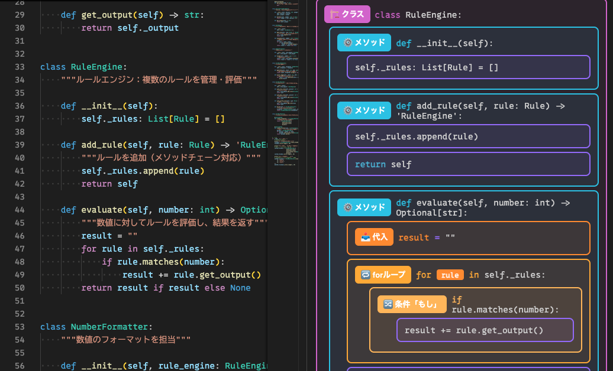

# Python Indent Visualizer

Pythonのインデント構造をネストされたブロックとして視覚的に表示するVS Code拡張機能です。


## 概要

Scratchなどのビジュアル言語を最初に学んだ人がPythonを学ぶにあたって、**最も障壁となるのがインデント**です。インデントがうまく理解できないため、スコープの範囲を誤るケースが多々見受けられます。

この拡張機能は、Pythonのコード構造を視覚的に表示することで、初学者がインデントとスコープの概念を直感的に理解できるようサポートします。

## 主な機能

### 🎨 構造的な可視化

- **カラーアイコン**: 各Pythonステートメント（if/for/while/def/classなど）を色分けされたアイコンで表示
- **ネストブロック**: インデントレベルに応じてネストされたブロックで構造を表現
- **キーワードハイライト**: Pythonキーワードがアイコンと同じ色でハイライト表示

### 📍 ステートメントタイプ

| アイコン | タイプ | 色 |
|---------|--------|-----|
| 条件 | if/elif/else | 青色 |
| ループ | for/while | 紫色 |
| 関数 | def | 緑色 |
| メソッド | クラス内のdef | 青緑色 |
| クラス | class | オレンジ色 |
| 例外 | try/except/finally | 赤色 |
| with | with | 黄色 |
| マッチ | match/case | ピンク色 |

### 🔄 インテリジェントなグループ化

- **通常の文のグループ化**: 同じスコープ内の連続する文を1つのブロックにまとめる
- **空行による分離**: 空行で異なるブロックとして分離
- **括弧内の改行対応**: リストや関数引数などの括弧内の改行を1つのブロックとして扱う
- **複数行の関数定義**: 引数を複数行に分けた関数定義も正しく表示

### 🔗 スクロール同期

- エディタのスクロールに合わせてビジュアライザーも自動スクロール
- コードの該当部分を常に確認しながら学習可能

### 💾 状態の保持

- 非Pythonファイルに切り替えても、最後に表示したPythonファイルの可視化を保持
- リファレンスとして常に表示しておくことが可能

## 使い方

1. **拡張機能を起動**
   - コマンドパレット（`Cmd+Shift+P` / `Ctrl+Shift+P`）を開く
   - `Open Python Indent Visualizer` と入力して実行
   - コマンドID: `python-indent-visualizer.open`

2. **Pythonファイルを開く**
   - 任意のPythonファイル（`.py`）を開くと、自動的に可視化が表示されます

3. **コードの編集**
   - コードを編集すると、リアルタイムで可視化が更新されます

4. **スクロール**
   - エディタをスクロールすると、ビジュアライザーも連動してスクロールします

## 使用例 / 表示イメージ

```python
def greet(name):
    if name:
        print(f"Hello, {name}")
    else:
        print("Hello")
```

上記コードを開くと、右ペインに各ステートメントが色付きブロックでネスト表示されます（if/elseが青系、defが緑系）。  


## インストール

### 開発版として実行

1. このリポジトリをクローン
```bash
git clone <repository-url>
cd python-visualizer
```

2. 依存関係をインストール
```bash
npm install
```

3. コンパイル
```bash
npm run compile
```

4. VS Codeで開く
```bash
code .
```

5. `F5`キーを押してExtension Development Hostを起動

## 開発

### プロジェクト構成

```
python-visualizer/
├── src/
│   ├── extension.ts       # 拡張機能のメインロジック
│   ├── indentTree.ts      # インデントツリー構築ロジック
│   └── webviewContent.ts  # ビジュアライザーのHTML/CSS/JS
├── out/                   # コンパイル済みファイル
├── package.json           # 拡張機能マニフェスト
└── tsconfig.json          # TypeScript設定
```

### ビルドコマンド

- **コンパイル**: `npm run compile`
- **ウォッチモード**: `npm run watch`
- **公開前ビルド**: `npm run vscode:prepublish`

## 設定

現時点でユーザー設定はありません。将来的にオプションが追加された場合はここに記載します。

## コマンド一覧

| コマンドID | タイトル | 説明 |
| --- | --- | --- |
| `python-indent-visualizer.open` | Open Python Indent Visualizer | ビジュアライザーを開きます |

## 技術仕様

### インデント検出

- タブは4スペースに変換
- インデントレベルからネスト構造を自動構築
- 括弧の開閉を追跡して複数行ステートメントを正しく処理

### ステートメント判定

以下の正規表現パターンでPythonのステートメントタイプを検出：
- コメントを除外した上で判定
- クラス内の`def`は自動的に「メソッド」として認識

### ビジュアル表現

- インデント幅を2スペースに圧縮して表示（読みやすさ向上）
- VS Codeのテーマカラーに適応
- セマンティックカラーでステートメントタイプを区別

## ライセンス

[MIT](LICENSE)

## アイコン

アイコンはDALL-Eで作成しました。

## 対象ユーザー

- Python初学者
- ビジュアルプログラミング（Scratchなど）から移行する学習者
- インデントベースの構文に不慣れな開発者
- Pythonコードの構造を視覚的に把握したい方

## フィードバック

バグ報告や機能要望は、GitHubのIssuesでお願いします。
